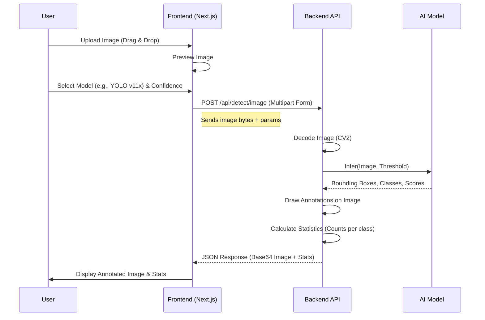
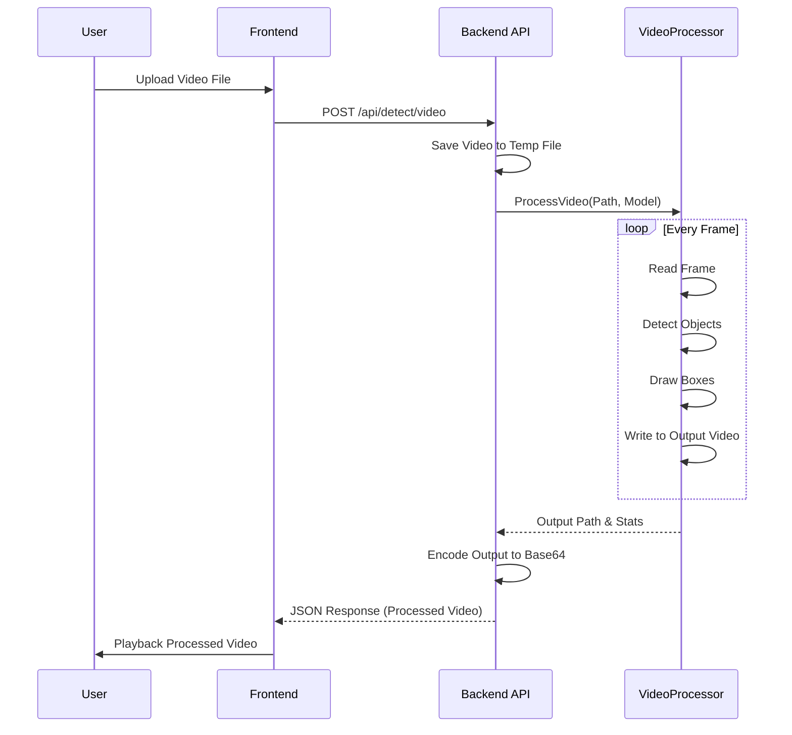

# Traffic Detection System - Detailed Flow Architecture

## 1. System Overview

The **Traffic Detection System** is a modern web application designed for real-time object detection in traffic scenarios. It leverages state-of-the-art deep learning models (YOLO v11 and SSD) to identify pedestrians, vehicles, and other traffic-related objects from images, video files, and live camera feeds.

The system is built on a **Client-Server Architecture**:
- **Frontend**: A responsive Next.js application that handles user interaction, media upload, and results visualization.
- **Backend**: A high-performance FastAPI server that processes media, manages AI models, and returns detection results.

---

## 2. Technology Stack

### Frontend (Client-Side)
- **Framework**: [Next.js 16](https://nextjs.org/) (React 19)
- **Language**: TypeScript
- **Styling**: Tailwind CSS v4, Phosphor Icons
- **State Management**: React Hooks (`useState`, `useEffect`)
- **HTTP Client**: Axios (via custom `api` wrapper)
- **Visualization**: HTML5 Canvas (for bounding boxes over video/images)

### Backend (Server-Side)
- **Framework**: [FastAPI](https://fastapi.tiangolo.com/) (Python 3.10+)
- **Computer Vision**: OpenCV (`cv2`), NumPy
- **AI Models**:
  - **YOLO v11**: Ultralytics implementation (Nano, Small, Medium, Large, XLarge)
  - **SSD**: Single Shot MultiBox Detector (Mobilenet Backbone)
  - **Ensemble**: Weighted combination of YOLO and SSD results
- **Server**: Uvicorn (ASGI)

---

## 3. High-Level Architecture Diagram

```mermaid
flowchart TB
    %% ===== STYLING =====
    classDef user fill:#fce4ec,stroke:#c2185b,stroke-width:3px,color:#000
    classDef frontend fill:#e3f2fd,stroke:#1565c0,stroke-width:2px,color:#000
    classDef network fill:#fff9c4,stroke:#f9a825,stroke-width:2px,color:#000
    classDef backend fill:#e8f5e9,stroke:#2e7d32,stroke-width:2px,color:#000
    classDef processor fill:#fff3e0,stroke:#ef6c00,stroke-width:2px,color:#000
    classDef ai fill:#f3e5f5,stroke:#7b1fa2,stroke-width:2px,color:#000
    classDef model fill:#ede7f6,stroke:#512da8,stroke-width:2px,color:#000
    classDef storage fill:#eceff1,stroke:#455a64,stroke-width:2px,color:#000
    classDef response fill:#c8e6c9,stroke:#388e3c,stroke-width:2px,color:#000

    %% ===== USER INTERACTION =====
    START((User)):::user
    ACTION{{"User Action"}}:::user
    
    START --> ACTION
    ACTION -->|"Upload Image"| IMG_UPLOAD
    ACTION -->|"Upload Video"| VID_UPLOAD
    ACTION -->|"Start Camera"| CAM_START
    ACTION -->|"Select Model"| MODEL_SELECT

    %% ===== FRONTEND LAYER =====
    subgraph FRONTEND["🖥️ FRONTEND (Next.js 16 + React 19 + TypeScript)"]
        direction TB
        
        subgraph PAGES["Pages"]
            IMG_PAGE["/dashboard/image"]:::frontend
            VID_PAGE["/dashboard/video"]:::frontend
            CAM_PAGE["/dashboard/camera"]:::frontend
        end
        
        subgraph COMPONENTS["React Components"]
            IMG_UPLOAD["Image Upload\nDrag & Drop Zone"]:::frontend
            VID_UPLOAD["Video Upload\nFile Selector"]:::frontend
            CAM_START["Camera Init\ngetUserMedia()"]:::frontend
            MODEL_SELECT["ModelSelector.tsx\nDropdown UI"]:::frontend
            CANVAS["Canvas Renderer\nBounding Box Overlay"]:::frontend
            STATS["DetectionStats.tsx\nClass Counts Display"]:::frontend
        end
        
        subgraph SERVICES["API Service Layer"]
            API_CLIENT["lib/api.ts\n(Axios HTTP Client)"]:::frontend
        end
        
        IMG_UPLOAD --> IMG_PAGE --> API_CLIENT
        VID_UPLOAD --> VID_PAGE --> API_CLIENT
        CAM_START --> CAM_PAGE --> API_CLIENT
        MODEL_SELECT --> API_CLIENT
    end

    %% ===== NETWORK LAYER =====
    subgraph NETWORK["🌐 HTTP NETWORK"]
        HTTP_REQ{{"HTTP Request\nPOST /api/detect/*\nMultipart Form Data"}}:::network
        HTTP_RES{{"HTTP Response\nJSON + Base64 Media"}}:::network
    end
    
    API_CLIENT --> HTTP_REQ

    %% ===== BACKEND LAYER =====
    subgraph BACKEND["⚙️ BACKEND (FastAPI + Python 3.10+ + Uvicorn)"]
        direction TB
        
        subgraph ROUTER["API Router (/api)"]
            HEALTH["GET /health"]:::backend
            MODELS_LIST["GET /models"]:::backend
            MODELS_SEL["POST /models/select"]:::backend
            DETECT_IMG["POST /detect/image"]:::backend
            DETECT_VID["POST /detect/video"]:::backend
        end
        
        subgraph PROCESSORS["Business Logic Layer"]
            IMG_PROC["ImageProcessor\n• Decode bytes → cv2\n• Run detection\n• Draw boxes\n• Encode to Base64"]:::processor
            VID_PROC["VideoProcessor\n• Extract frames\n• Process each frame\n• Reassemble video\n• Encode to Base64"]:::processor
            STATS_CALC["Statistics Calculator\n• Count by class\n• Processing time\n• Confidence stats"]:::processor
        end
        
        subgraph MODEL_MGR["Model Management"]
            GET_DET["get_detector()\nFactory Function"]:::backend
            ACTIVE["_active_model\nGlobal State"]:::backend
            CACHE["_detectors{}\nLoaded Model Cache"]:::backend
        end
        
        HTTP_REQ -->|"Image"| DETECT_IMG
        HTTP_REQ -->|"Video"| DETECT_VID
        HTTP_REQ -->|"Model Select"| MODELS_SEL
        
        DETECT_IMG --> IMG_PROC
        DETECT_VID --> VID_PROC
        MODELS_SEL --> ACTIVE
        
        IMG_PROC --> GET_DET
        VID_PROC --> GET_DET
        GET_DET --> CACHE
        
        IMG_PROC --> STATS_CALC
        VID_PROC --> STATS_CALC
    end

    %% ===== AI INFERENCE ENGINE =====
    subgraph AIENGINE["🤖 AI INFERENCE ENGINE"]
        direction TB
        
        subgraph DETECTORS["Detector Classes"]
            YOLO_DET["YOLODetector\nCustom Traffic Model\n8 Classes"]:::ai
            YOLO_COCO["YOLOCocoDetector\nPre-trained COCO\n80 Classes"]:::ai
            SSD_DET["SSDDetector\nMobileNet Backbone\nCOCO Classes"]:::ai
            ENSEMBLE["Ensemble Logic\nYOLO + SSD\n+ NMS Merge"]:::ai
        end
        
        subgraph WEIGHTS["Model Weights (.pt files)"]
            W_N["yolo11n.pt\n~5MB Nano"]:::model
            W_S["yolo11s.pt\n~18MB Small"]:::model
            W_M["yolo11m.pt\n~40MB Medium"]:::model
            W_L["yolo11l.pt\n~75MB Large"]:::model
            W_X["yolo11x.pt\n~140MB XLarge"]:::model
        end
        
        subgraph LIBS["Core Libraries"]
            ULTRALYTICS["Ultralytics\nYOLO v11"]:::ai
            PYTORCH["PyTorch\nTensor Ops"]:::ai
            OPENCV["OpenCV cv2\nImage Processing"]:::ai
            NUMPY["NumPy\nArray Math"]:::ai
        end
        
        CACHE --> YOLO_DET & YOLO_COCO & SSD_DET
        YOLO_DET --> ULTRALYTICS
        YOLO_COCO --> ULTRALYTICS
        SSD_DET --> PYTORCH
        ENSEMBLE --> YOLO_DET & SSD_DET
        
        ULTRALYTICS --> W_N & W_S & W_M & W_L & W_X
    end

    %% ===== INFERENCE OUTPUT =====
    subgraph OUTPUT["DETECTION OUTPUT"]
        BOXES["Bounding Boxes\n{x1, y1, x2, y2}"]:::response
        CLASSES["Class Labels\ncar, pedestrian, etc."]:::response
        SCORES["Confidence Scores\n0.0 - 1.0"]:::response
    end
    
    YOLO_DET & YOLO_COCO & SSD_DET --> BOXES & CLASSES & SCORES
    BOXES & CLASSES & SCORES --> OPENCV
    OPENCV -->|"Draw Annotations"| IMG_PROC
    OPENCV -->|"Draw Annotations"| VID_PROC

    %% ===== RESPONSE FLOW =====
    STATS_CALC --> HTTP_RES
    IMG_PROC -->|"Base64 Image"| HTTP_RES
    VID_PROC -->|"Base64 Video"| HTTP_RES
    
    HTTP_RES --> API_CLIENT
    API_CLIENT --> CANVAS
    API_CLIENT --> STATS
    
    CANVAS --> DISPLAY
    STATS --> DISPLAY

    DISPLAY(("User Sees\nAnnotated Media\n+ Statistics")):::user

    %% ===== STORAGE =====
    subgraph STORAGE["💾 FILE SYSTEM"]
        TEMP["/tmp/\nTemp Video Files"]:::storage
        WEIGHTS_DIR["backend/*.pt\nModel Weights"]:::storage
        CONFIG["config/settings.py\nClass Names & Colors"]:::storage
    end
    
    VID_PROC <-.->|"Read/Write"| TEMP
    ULTRALYTICS <-.->|"Load"| WEIGHTS_DIR
```



---

## 4. Detailed Component Flow

### 4.1 Backend Module Structure

The backend is organized into distinct layers to separate concerns:

| Component | Responsibility | Key Files |
|-----------|----------------|-----------|
| **Entry Point** | App initialization, CORS, Middleware | `main.py` |
| **Routes** | API Endpoint definitions, request validation | `routes/detection.py`, `routes/video.py` |
| **Processors** | Business logic for media handling | `processors/image_processor.py`, `processors/video_processor.py` |
| **Detectors** | Wrappers around AI models | `detectors/yolo_detector.py`, `detectors/ssd_detector.py` |
| **Utils** | Helper functions (downloads, config) | `utils/`, `config/settings.py` |

### 4.2 Frontend Module Structure

The frontend follows the Next.js App Router structure:

| Component | Responsibility | Key Files |
|-----------|----------------|-----------|
| **App Shell** | Global layout, styles, providers | `app/layout.tsx`, `app/globals.css` |
| **Dashboard** | Main application hub | `app/dashboard/page.tsx` |
| **Features** | Specific detection modes | `app/dashboard/(image|video|camera)/page.tsx` |
| **Components** | Reusable UI elements | `components/DataCard.tsx`, `components/ModelSelector.tsx` |
| **Services** | API communication layer | `lib/api.ts` |

---

## 5. Functional Workflows

### 5.1 Image Detection Flow

This flow describes how a user processes a static image.



### 5.2 Video Processing Flow

Processing video involves frame-by-frame analysis.



### 5.3 Model Selection & Ensemble Logic

The system allows dynamic switching of models.

1.  **Selection**: User selects a model via `ModelSelector.tsx`.
2.  **Request**: Frontend calls `/api/models/select`.
3.  **Loading**: Backend checks if the model is loaded in memory (`_detectors`).
    *   If not, it requests the model to load (weights are downloaded if missing).
    *   `_active_model` global variable is updated.
4.  **Ensemble Mode**:
    *   If "Ensemble" is selected, both YOLO and SSD are loaded.
    *   During inference, predictions from both are generated.
    *   **NMS (Non-Maximum Suppression)** merges overlapping boxes to reduce duplicates.

---

## 6. API Specification Summary

### Core Endpoints

*   **`GET /api/health`**
    *   Returns system status and currently active model.

*   **`GET /api/models`**
    *   Lists all available models, their descriptions, and memory status.

*   **`POST /api/models/select`**
    *   **Body**: `{ "model": "yolo11x" }`
    *   Switches the active detection engine.

*   **`POST /api/detect/image`**
    *   **Form Data**: `file` (binary), `confidence` (float), `model` (optional override).
    *   **Returns**: Annotated image (Base64), detection list, and object counts.

*   **`POST /api/detect/video`**
    *   **Form Data**: `file` (binary), `confidence` (float), `skip_frames` (int).
    *   **Returns**: Processed video (Base64) and aggregate stats.

---

## 7. Data Structures

### Detection Object
Standardized format for all detectors:
```json
{
  "class_name": "car",
  "class_id": 2,
  "confidence": 0.95,
  "bbox": {
    "x1": 100,
    "y1": 150,
    "x2": 300,
    "y2": 400
  }
}
```

### Statistics Summary
```json
{
  "total_objects": 15,
  "counts": {
    "car": 10,
    "pedestrian": 3,
    "truck": 2
  },
  "processing_time_ms": 145
}
```
